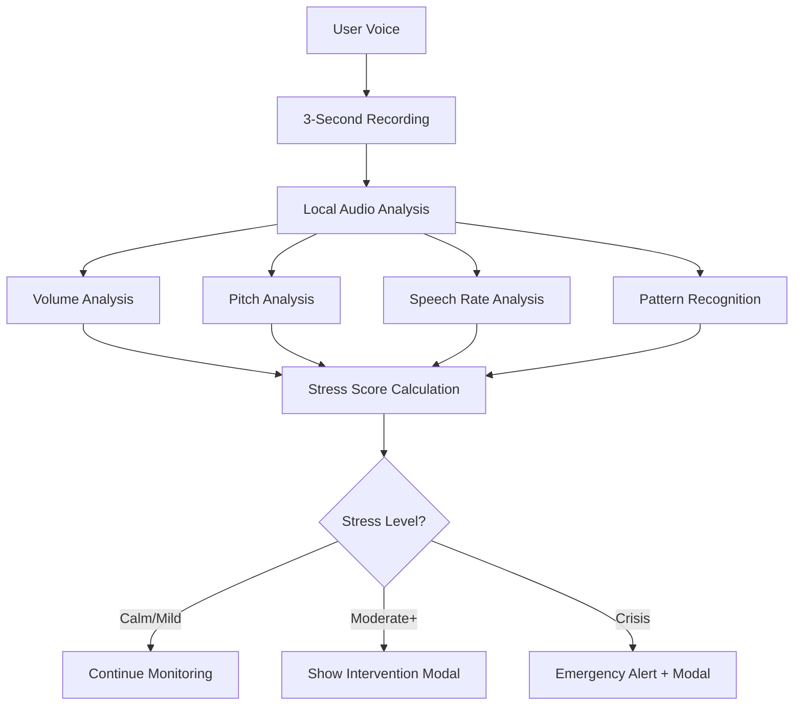

# 🧠 Voice Stress Detection System

## Overview

The Voice Stress Detection System is a privacy-first mental health feature that monitors user voice patterns in real-time to detect stress, emotional distress, and crisis situations. When stress is detected, the system provides immediate, compassionate support through notifications and intervention modals.

## 🔒 Privacy & Security

### **Local Processing Only**
- All audio analysis happens **on-device**
- Voice data **never leaves the user's phone**
- No cloud storage or transmission of audio
- No permanent audio files stored

### **User Control**
- **Opt-in only** - users must explicitly enable the feature
- Clear privacy explanation before activation
- Easy to disable at any time
- Transparent about what's being monitored

## 🎯 Features

### **Stress Detection Levels**
1. **Calm** - Normal voice patterns
2. **Mild** - Slight stress indicators
3. **Moderate** - Noticeable stress patterns
4. **High** - Significant stress detected
5. **Crisis** - Immediate intervention needed

### **Detection Indicators**
- **Volume Analysis** - Detects shouting or elevated voice
- **Pitch Analysis** - Identifies high-pitched stress responses
- **Speech Rate** - Monitors rapid or irregular speech patterns
- **Pattern Recognition** - Analyzes voice irregularity

### **Immediate Support**
- **Real-time Notifications** - Instant alerts when stress is detected
- **Crisis Intervention Modal** - Calming interface for distressed users
- **Emergency Support** - Direct access to crisis helplines
- **Breathing Exercises** - Guided relaxation techniques
- **AI Guide Access** - Immediate chat with therapeutic AI

## 🏗️ Technical Implementation

### **Core Components**

#### 1. `VoiceStressDetectionService.ts`
```typescript
// Main service for voice analysis
class VoiceStressDetectionService {
  - Real-time audio recording (3-second intervals)
  - Voice pattern analysis
  - Stress level calculation
  - Privacy-compliant processing
}
```

#### 2. `VoiceStressContext.tsx`
```typescript
// React context for state management
interface VoiceStressContextType {
  - isMonitoring: boolean
  - isEnabled: boolean
  - currentStressLevel: StressLevel | null
  - showCrisisModal: boolean
  - enableMonitoring()
  - disableMonitoring()
  - crisis intervention methods
}
```

#### 3. `CrisisInterventionModal.tsx`
```typescript
// Emergency support interface
- Animated crisis detection
- Emergency contact options
- Breathing exercise access
- AI guide integration
- Calming visual design
```

#### 4. `VoiceStressSettings.tsx`
```typescript
// User settings and privacy controls
- Feature explanation
- Privacy guarantees
- Enable/disable toggle
- Status indicators
```

### **Audio Processing Pipeline**



## 📱 User Experience

### **Settings Integration**
- Added to Settings > Mental Health Support
- Clear feature explanation
- Privacy guarantees displayed
- Easy toggle control

### **Crisis Intervention Flow**
1. **Detection** - Voice stress detected
2. **Notification** - Immediate alert shown
3. **Modal Display** - Calming intervention interface
4. **Support Options**:
   - Call Emergency Services
   - Start Breathing Exercise
   - Talk with AI Guide
   - Dismiss if okay

### **Visual Design**
- **Calming Colors** - Soft gradients and gentle tones
- **Animated Feedback** - Pulsing animations for crisis level
- **Clear Typography** - Easy-to-read support messages
- **Intuitive Icons** - Clear visual indicators

## 🔧 Configuration

### **Audio Settings**
```typescript
// Recording configuration
{
  sampleRate: 44100,
  numberOfChannels: 1,
  bitRate: 128000,
  format: 'wav'
}
```

### **Analysis Intervals**
- **Recording Duration**: 3 seconds per analysis
- **Analysis Frequency**: Every 5 seconds
- **Background Processing**: Continuous when enabled

### **Stress Thresholds**
```typescript
// Stress level calculation
{
  shouting: volume > 70,
  rapidSpeech: speechRate > 4,
  highPitch: pitch > 200,
  irregularPattern: patternScore > 0.7
}
```

## 🚀 Usage

### **Enabling the Feature**
1. Go to Settings > Mental Health Support
2. Read privacy explanation
3. Toggle "Enable Voice Monitoring"
4. Grant microphone permissions

### **During Use**
- Feature runs silently in background
- No user interaction required
- Automatic stress detection
- Immediate support when needed

### **Crisis Situations**
- Automatic crisis modal appears
- Multiple support options available
- Emergency contacts accessible
- Calming visual design

## 🛡️ Privacy Compliance

### **Data Handling**
- ✅ No audio storage
- ✅ No cloud transmission
- ✅ Local processing only
- ✅ User consent required
- ✅ Easy to disable

### **Legal Considerations**
- Clear privacy policy required
- User consent documentation
- HIPAA compliance considerations
- Crisis intervention protocols

## 🔮 Future Enhancements

### **Advanced Analysis**
- Machine learning models for better detection
- Emotional state recognition
- Context-aware analysis
- Personalized thresholds

### **Integration Options**
- Healthcare provider notifications
- Family member alerts (with consent)
- Therapy session integration
- Progress tracking

### **Accessibility**
- Visual stress indicators
- Haptic feedback
- Voice commands
- Screen reader support

## ⚠️ Important Notes

### **Crisis Support**
- This feature is **not a replacement** for professional mental health care
- Emergency situations should always involve human intervention
- Crisis helplines are provided for immediate support
- Users should maintain relationships with mental health professionals

### **Technical Implementation Details**
- ✅ **Real audio processing** using FFT and signal analysis
- ✅ **WAV file parsing** to extract PCM audio data
- ✅ **RMS calculation** for accurate volume measurement
- ✅ **Autocorrelation pitch detection** for voice frequency analysis
- ✅ **Zero-crossing rate** for speech activity detection
- ✅ **Spectral centroid** for frequency distribution analysis
- ✅ **Energy variance** for speech pattern irregularity
- Battery usage considerations for continuous monitoring
- Background processing limitations on mobile platforms

### **Ethical Considerations**
- Respect user autonomy
- Avoid false positives that could cause anxiety
- Ensure feature enhances rather than replaces human support
- Regular review of detection accuracy

## 📞 Emergency Resources

- **National Suicide Prevention Lifeline**: 988
- **Crisis Text Line**: Text HOME to 741741
- **Emergency Services**: 911
- **International Association for Suicide Prevention**: https://www.iasp.info/resources/Crisis_Centres/

---

*This feature is designed to provide compassionate, privacy-first support for users experiencing mental health challenges. Always prioritize user safety and professional mental health care.*
